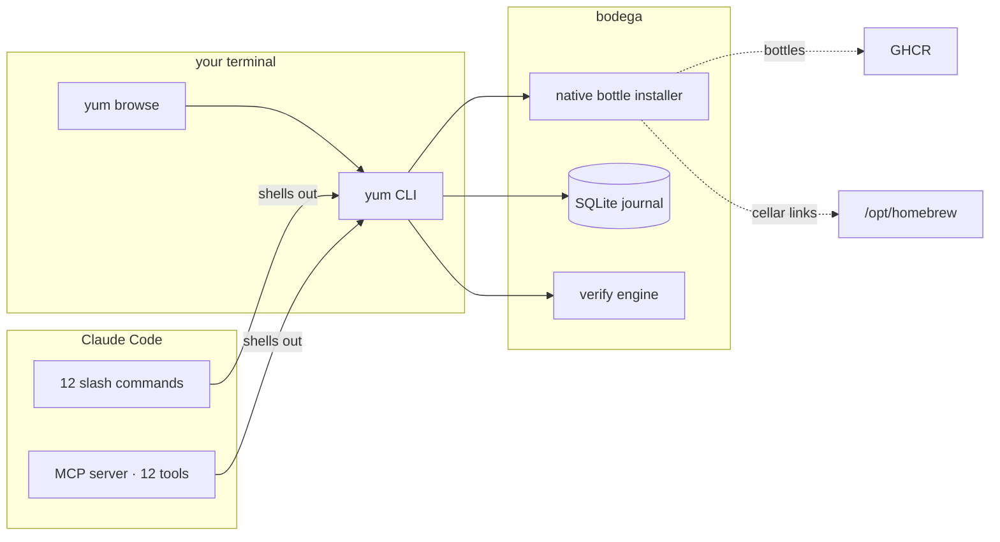

<p align="center">
  
</p>

<p align="center">
  <a href="https://github.com/hunchom/bodega/actions/workflows/ci.yml"></a>
  <a href="https://github.com/hunchom/bodega/blob/main/LICENSE"></a>
  
  
  
  
</p>

<p align="center">
  <a href="#why">Why</a>
  &middot;
  <a href="#install">Install</a>
  &middot;
  <a href="#ask-claude-things-like">Ask Claude</a>
  &middot;
  <a href="#reliability">Reliability</a>
  &middot;
  <a href="#limitations">Limitations</a>
  &middot;
  <a href="#vs-brew">vs brew</a>
</p>

---

**A macOS package manager with a `yum` / `dnf` command surface, a native Go bottle installer that's ~4× faster than `brew install`, a real transaction journal, a proper TUI, and first-class Claude Code integration.**

Twenty-nine commands. Every read supports `--json`. Every mutation writes to a SQLite journal. Every install you ship can be undone with `yum history undo`.

- **Native bottle installer** — resolves deps from brew's JWS cache, downloads via GHCR OAuth2, extracts, relocates Mach-O + re-codesigns. Falls back to `brew` for casks and source builds.
- **Transactional** — install / remove / upgrade / reinstall / pin / sync / manifest-apply all journaled. Undo any one with `yum history undo <id>`.
- **Interactive TUI** — `yum browse`. Two panes, live filter, amber installed / dim latest, install-from-keyboard, help overlay.
- **Claude Code plugin** — 12 slash commands, a proactive `package-doctor` agent, a `yum-packages` skill.
- **MCP server** — Anthropic-native TypeScript, `@modelcontextprotocol/sdk` + zod. 12 tools, 3 resources, 2 templates, 2 prompts. Claude can call `yum_install` mid-conversation.

### From the shell

```bash
yum install ripgrep              # native fast path — ~0.74s vs 3.02s for brew
yum browse                       # interactive TUI
yum search "text editor" --deps  # ranked: name → desc → tap → dep-of
yum log ripgrep                  # every event that's ever touched this package
yum verify                       # missing deps, broken symlinks, orphaned versions
yum duplicates --prune           # collapse multi-version cellar entries
yum history undo 14              # roll back the last transaction
yum manifest export > pkgs.toml  # declarative system snapshot
yum sync                         # refresh + upgrade + autoremove + cleanup, journaled
```

### From a Claude Code session

```text
install ripgrep and bat
what's outdated
why do i have two copies of openssl
verify my install tree — actually fix the broken symlinks
show me every event for git, then undo whatever changed it yesterday
browse my installed packages
```

You're not telling Claude to shell out. With the MCP server installed, Claude calls `yum_install`, `yum_verify`, `yum_log` as typed tools.

---

## Why

Without bodega, installing a package through Claude looks like this:

```
you:    install ripgrep and see what's outdated
Claude: [bash: brew install ripgrep]
        [3.02s of install output pours in, eating your context window]
        [bash: brew outdated]
        [plain text list, no versions, no semver diff]
        done. want me to upgrade?
```

With bodega:

```
you:    install ripgrep and see what's outdated
Claude: [yum_install ripgrep]   done in 0.74s, journaled as tx #47
        [yum_outdated]          17 outdated — 2 major, 4 minor, 11 patch
        shall i upgrade the 11 patch bumps?
```

Same ask. Quarter the time, structured output, one reversible transaction.

## What changes

|  | brew | bodega |
|---|---|---|
| **Install speed (bottled)** | ~3s cold, serial deps | ~0.7s, GHCR-parallel, native extract + codesign |
| **Undo an install** | `brew uninstall` loses the version info | `yum history undo <id>` — typed, reversible, journaled |
| **"what changed yesterday"** | `cat ~/.brew/brew-history-file` if you feel brave | `yum history`, `yum log <pkg>`, both `--json` |
| **Outdated at a glance** | a flat list | semver-diff colored: major red · minor amber · patch green |
| **Interactive browse** | — | `yum browse` TUI: filter, preview, install, remove |
| **Integrity check** | `brew doctor` (system-level) | `yum verify` — missing deps, broken symlinks, orphaned versions, stale pins; `--fix` |
| **Claude Code** | `bash: brew …` every time | 12 slash commands + 12 MCP tools + 2 prompts + subagent |
| **JSON output** | `--json=v2` on some commands | `--json` on every read |
| **Dry run** | partial | every mutation |

## What it is



- **Native fast path** for bottled formulae; brew subprocess for casks and source builds — automatic fallback on `ErrNativeUnsupported`.
- **Journal is authoritative.** Every mutation writes a row. Rollback replays in reverse.
- **The TUI is the CLI.** `yum browse` wires into the same backends — it's a renderer, not a second implementation.
- **Claude talks to `yum`, not brew.** The plugin's slash commands and MCP tools both shell out to the binary.

## Install

**From source:**

```bash
git clone https://github.com/hunchom/bodega ~/bodega
cd ~/bodega
./build.sh --install
```

Binary lands at `~/.local/bin/yum`; zsh completions at `~/.zsh/completions/_yum`.

```sh
fpath=(~/.zsh/completions $fpath)
autoload -U compinit && compinit
```

**Claude Code plugin** (in any Claude session):

```text
/plugin install claude-plugin/ from the local bodega repo
```

Or copy the directory into `~/.claude/plugins/` manually.

**MCP server** (TypeScript, adds 12 `yum_*` tools to Claude's tool list):

```bash
cd ~/bodega/mcp-server
npm install
npm run build
npm link                        # puts bodega-mcp on PATH
```

The claude-plugin ships a `.mcp.json` that references `bodega-mcp` — once it's on PATH, the MCP tools auto-register when you enable the plugin.

> [!TIP]
> Restart your Claude Code session after `npm link` so the tool registry reloads. Verify with "list my installed packages" — Claude should call `yum_list` directly instead of shelling out to `brew`.

## Configure

`~/.config/yum/config.toml` (optional):

```toml
[theme]
accent = "amber"
no_color = false

[defaults]
parallel = true

[aliases]
i = "install"
r = "remove"
u = "upgrade"
```

Global flags apply to every command:

```
--json          machine-readable output (every read command)
--yes / -y      assume yes on prompts
--no-color      disable ANSI
--dry-run       show what would happen — no side effects
--refresh       force tap refresh (skipped on --dry-run)
--no-refresh    skip tap refresh even if stale
--debug         verbose
--config PATH   override config.toml location
```

## Ask Claude things like

```
install ripgrep and bat, then show me what changed
what's outdated — just the patch bumps
why is my openssl install so big
verify my install tree and fix the broken symlinks
show me the last 10 transactions
undo transaction 47
browse my installed packages grouped by leaf
remove anything that autoremove would remove, but show me first
export my current state as a manifest i can reapply
```

You're describing outcomes. The MCP server picks the tools.

## Reliability

Installs mutate your filesystem. bodega treats that seriously:

- **Every mutation writes a journal row** before it runs, closes it when it finishes. A killed `yum install` leaves a recorded transaction with exit-code 1 — you can see what was attempted, even if nothing got extracted.
- **Native install rolls back per-plan.** If dep 3 of 5 fails, deps 1–2 are unlinked and their cellar dirs removed before the error surfaces. No half-installed kegs.
- **Sha256 verified.** Every GHCR-downloaded bottle is streamed through a `TeeReader` into sha256; a mismatch aborts before extract.
- **Re-codesigned.** Mach-O binaries touched by `install_name_tool` are re-signed with `codesign --force --sign -` (macOS 11+ refuses to run modified binaries otherwise).
- **Reverse-dep guard.** `yum remove openssl` refuses if anything installed still depends on it. `--force` to override; `--ignore-deps` to skip the check entirely.
- **5-minute info cache is invalidated on mutation.** Install, remove, reinstall, upgrade, autoremove, pin, and cleanup all clear the affected entries.
- **`yum verify`** walks the install tree: missing runtime deps, dangling symlinks, orphaned cellar versions (semver-correct, not string-compare), stale pins. `--fix` removes dangling symlinks.

Golden-file tests cover `yum --help` output; table / panel / tree renderers test against fixtures; native install, link/unlink, resolver, duplicates, and verify all test against synthetic prefixes under `t.TempDir()`. MCP server tests mock the subprocess and cover 13 shape/error/contract scenarios.

## vs brew

|  | `brew` | `yum` (bodega) |
|---|---|---|
| Install a bottle | Ruby, serial deps, ~3s | Go, parallel GHCR, ~0.7s |
| Undo an install | `brew uninstall` + manual cleanup | `yum history undo <id>` |
| Inspect history | `brew history` doesn't exist | `yum history`, `yum log <pkg>` |
| Find dep tree | `brew deps --tree` | `yum tree`, `yum why` |
| Disk per package | `brew-du` (third party) | `yum size` |
| Machine output | `brew info --json=v2` (some commands) | `--json` everywhere |
| Dry run | partial | every mutation |
| TUI | — | `yum browse` |
| Claude Code | none built-in | 12 slash commands + 12 MCP tools |
| Cask installs | ✓ | ✓ (via brew fallback, today) |
| Source builds | ✓ | ✓ (via brew fallback, today) |

The pitch isn't "brew is bad." The pitch is "brew is a Ruby subprocess with a plain-text UI — Claude and the shell both deserve structured, fast, reversible ops."

## Limitations

What this doesn't do, today, honestly:

- **Not a brew replacement for casks or `--build-from-source`.** The native path is bottled formulae only; everything else transparently falls back to `brew install`. This is by design — tap resolution, bottle tag fallback, and Mach-O relocation are the interesting parts; casks and source builds are not.
- **Apple Silicon + Intel macOS only.** Linuxbrew works through the fallback path, but bottle tag resolution and GHCR retrieval assume `arm64_<macos>` or `x86_64_<macos>`.
- **No cross-machine sync.** `manifest export` / `apply` is declarative within one machine. No multi-host rollout, no remote state store.
- **TUI requires a real terminal.** Not a Claude Code TUI-rendering thing — it's bubbletea, which needs a proper stdio + TTY.
- **MCP tool surface is 12 tools, not 29.** The CLI's `tree`, `why`, `size`, `provides`, `repolist`, `doctor`, `rollback`, `browse`, `completions`, `version`, `clean`, `pin`, `manifest`, `sync`, `autoremove`, `reinstall`, `help` are not MCP-exposed. Add via the tool-registration pattern in `mcp-server/src/tools/` if you want them.

## Testing

```bash
go test ./...                   # 10 packages, all green
go vet ./...                    # clean
staticcheck ./...               # clean

cd mcp-server
npm test                        # 13/13 tests, node:test
npx tsc --noEmit                # strict TS, 0 diagnostics
npm audit --omit=dev            # 0 vulnerabilities
```

CI runs the Go matrix (macos-13, macos-14, ubuntu-latest × Go 1.26) on every push.

## Layout

```
cmd/yum/                 entrypoint
internal/backend/brew/   native bottle installer, GHCR, link/unlink, resolver, services
internal/cmd/            cobra commands (one per file, 29 commands)
internal/config/         TOML config loader
internal/journal/        SQLite transaction log + rollback planner + per-package log
internal/runner/         exec abstraction
internal/semver/         semver-diff classification
internal/tui/browse/     bubbletea TUI (~1,700 LOC)
internal/ui/             tables, panels, trees, picker, theme
internal/verify/         install-tree integrity engine
mcp-server/              Anthropic-native MCP server (TypeScript, zod)
claude-plugin/           Claude Code plugin (12 slash commands, agent, skill)
assets/                  hero SVG and repo imagery
docs/                    audit reports, design notes
```

## License

MIT.
